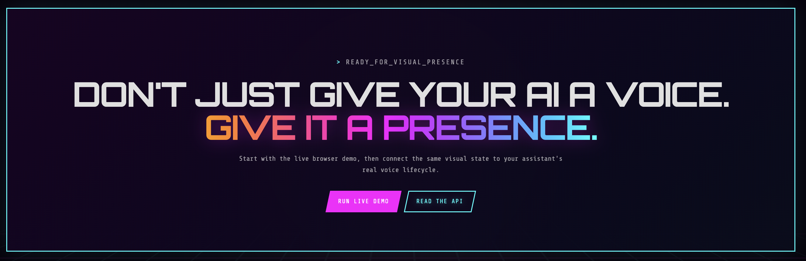

# Living AI Orb — Interactive Voice Assistant Particle Visualizer

[](https://dinuduke.github.io/living-ai-orb/)
[](index.html)
[](orb.js)
[](https://github.com/dinuduke/living-ai-orb/stargazers)

A lightweight, dependency-free **AI voice orb** for conversational interfaces, virtual assistants, voice agents and realtime AI experiences. It uses HTML Canvas and vanilla JavaScript to create a living particle sphere that reacts to speech, microphone input, hover, touch and click interactions.

[**Open the live demo →**](https://dinuduke.github.io/living-ai-orb/)


> If this component helps your voice UI or AI assistant project, consider starring the repository so other developers can discover it too.

## What it looks like


## Why this project

Modern voice AI products need more than a microphone icon. A visual assistant should communicate state and presence: calm while idle, responsive while listening, expressive while speaking, and tactile when the user interacts with it.



Living AI Orb is designed as a reusable front-end building block for:

- AI voice assistants
- virtual assistant interfaces
- voice agents and realtime AI
- conversational AI products
- AI avatar and digital-assistant UIs
- chatbot voice mode
- ambient AI interfaces
- audio-reactive visualizations
- interactive particle experiences

## Features

- **Living particle sphere** — fine particles form a soft 3D-like orb
- **Speech-aware animation** — the perimeter ripples and glows while the assistant talks
- **Circle ↔ oval morphing** — the orb expands primarily on the horizontal axis and eases back naturally
- **Left-to-right color travel** — warm hues move visibly across the surface
- **Browser text-to-speech** — built on `SpeechSynthesisUtterance`
- **Microphone reactivity** — real input amplitude through the Web Audio API
- **Hover / touch response** — nearby particles flow around the pointer
- **Click ripple** — creates a temporary wave through the particle membrane
- **Responsive Canvas rendering** — works across desktop and mobile layouts
- **Zero runtime dependencies** — no framework or build step required
- **Public control API** — integrate it with another voice agent, TTS service or assistant backend

## Quick start

Clone the repository and serve it locally:

```bash
git clone https://github.com/dinuduke/living-ai-orb.git
cd living-ai-orb
python3 -m http.server 8080
```

Then open:

```text
http://localhost:8080
```

Microphone access normally requires HTTPS or `localhost`.

## Use it in your own AI project

The orb exposes a small browser API after initialization:

```js
window.addEventListener("living-ai-orb-ready", () => {
  LivingAIOrb.setText("Hello. How can I help you today?");
  LivingAIOrb.speak();
});
```

If your own voice agent already controls audio, drive the visual state directly:

```js
LivingAIOrb.setSpeaking(true);  // assistant starts speaking
LivingAIOrb.setSpeaking(false); // assistant finishes speaking
```

Available methods:

```js
LivingAIOrb.setText("Text to speak");
LivingAIOrb.speak();
LivingAIOrb.stop();
LivingAIOrb.setSpeaking(true);
LivingAIOrb.setSpeaking(false);
LivingAIOrb.setPaletteShift();
```

See **[INTEGRATION.md](INTEGRATION.md)** for iframe, custom TTS, voice-agent, React and Next.js integration patterns.

## Example voice-agent lifecycle

```js
voiceAgent.on("assistant_speaking", () => {
  LivingAIOrb.setSpeaking(true);
});

voiceAgent.on("assistant_stopped", () => {
  LivingAIOrb.setSpeaking(false);
});
```

This pattern can be used with a custom WebSocket voice service or platforms such as realtime voice-agent SDKs, TTS providers and agent frameworks.

## Architecture

```text
User interaction
      │
      ├── Pointer Events ──────────────┐
      ├── Microphone / Web Audio ─────┤
      └── Text / Speech Synthesis ────┤
                                      ▼
                             Animation state
                                      │
              ┌───────────────────────┼──────────────────────┐
              ▼                       ▼                      ▼
        Shape morphing          Particle field         Color travel
        circle ↔ oval           hover / ripple         left → right
              │                       │                      │
              └───────────────────────┼──────────────────────┘
                                      ▼
                                Canvas renderer
```

## Speaking behavior

The speaking state is intentionally more expressive than idle mode. While speech is active:

- perimeter particles become brighter
- edge halos expand
- the silhouette carries travelling waves
- the current circle/oval outline becomes more luminous
- motion follows a slower speech envelope instead of rapid jitter

When speech stops, the extra edge glow fades and the orb returns to a calm ambient state.

## Customize it

Useful values in `orb.js` include:

| Setting | What it changes |
|---|---|
| `COUNT` | Particle density |
| `horizontalStretch` | Left/right morph intensity |
| `waveAmount` | Edge deformation |
| `hue` / `hueTarget` | Base color family |
| `talkEdge` | Speaking-edge brightness |
| `talkHalo` | Speaking halo size |
| pointer radius / push | Hover and touch response |

## SEO / discovery terms

This project is relevant to developers searching for **AI orb**, **voice orb**, **voice assistant orb**, **AI voice assistant UI**, **voice AI UI**, **voice agent UI**, **virtual assistant UI**, **conversational AI UI**, **realtime voice interface**, **audio-reactive orb**, **particle orb**, **interactive AI avatar**, **living AI interface**, **Web Audio API**, **Web Speech API**, and **JavaScript Canvas animation**.

## GitHub topics

Recommended repository topics:

`ai-orb` `voice-orb` `voice-assistant` `voice-ai` `voice-agent` `virtual-assistant` `conversational-ai` `audio-visualizer` `web-audio-api` `web-speech-api` `javascript` `canvas-animation` `particle-animation` `interactive-ui` `ai-interface`

## Browser support

Best experience is in current Chrome, Edge, Firefox and Safari releases with Canvas and modern JavaScript support. Built-in microphone mode requires user permission.

## Project structure

```text
.
├── index.html
├── style.css
├── orb.js
├── README.md
├── INTEGRATION.md
├── CONTRIBUTING.md
├── llms.txt
├── robots.txt
├── sitemap.xml
├── media/
│   ├── social-preview.svg
│   ├── orb-idle.svg
│   └── orb-speaking.svg
├── examples/
│   └── embed.html
└── .github/
    └── workflows/
        └── pages.yml
```

## GitHub Pages

A Pages workflow is included. Enable **Settings → Pages → Source → GitHub Actions** and the repository root will deploy as the live static site.

## Share the project

If you know someone building a voice assistant, voice agent or conversational AI interface, share the repository:

- [Share on X](https://twitter.com/intent/tweet?text=Living%20AI%20Orb%20%E2%80%94%20interactive%20voice%20assistant%20particle%20visualizer&url=https%3A%2F%2Fgithub.com%2Fdinuduke%2Fliving-ai-orb)
- [Share on LinkedIn](https://www.linkedin.com/sharing/share-offsite/?url=https%3A%2F%2Fgithub.com%2Fdinuduke%2Fliving-ai-orb)

## Contributing

Contributions are welcome for performance improvements, additional assistant states, voice-provider integrations, visual themes and accessibility improvements. See [CONTRIBUTING.md](CONTRIBUTING.md).
